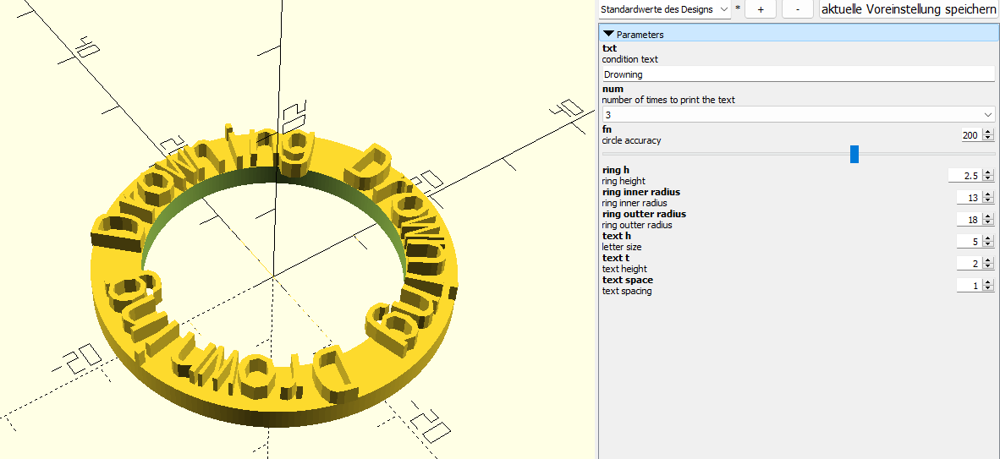

# Dungeons and Dragons condition trackers

# manual build
use openscad's built-in customizer to change the txt and num values (num=how many times to print the text. for short text there is more space available to print them multiple times)

# automated builds
## Building the STL files from source
To build stls (on windows), download and install OpenScad, put it in your `PATH` environment variable and then run the included bat files.

## Add new conditions
To add new conditions, edit the matching `.bat` file and run it, or create a new one. 
